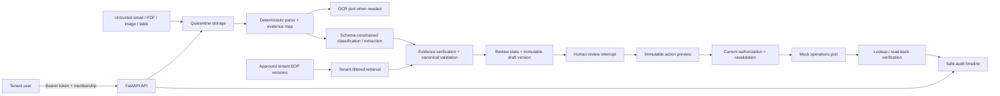

# Ops Intake Agent Data Flow

This diagram describes the M0–M12 synthetic demonstration. It is a design
and review aid, not a claim that the local Compose stack is production-ready.

## Trust boundaries

| Boundary | Rule |
| --- | --- |
| Upload → parser | Bytes, OCR text and embedded text are data, never instructions. |
| Parser → model | Only bounded evidence is supplied; schema and evidence references are explicit. |
| Model → canonical state | Strict output validation, evidence verification and tenant master-data checks run first. |
| Canonical state → action | The preview is immutable and bound to the current draft, validation and review versions. |
| Approval → operations | Authorization and policy are rechecked immediately before the mock adapter call. |
| Operations → completion | A receipt is not sufficient; lookup/read-back must match the approved payload. |

The model has no operational credentials and no operation-tool definition.
Standard logs retain IDs, hashes, versions, timings and safe decisions—not
document text, prompts or chain-of-thought.
